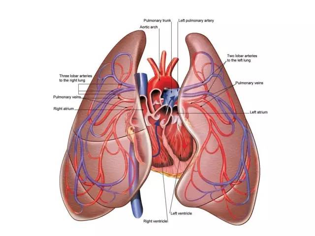

# 它绝非仅是组织活检的替代品{#not-only-for-replace-tissue}

第2期，我们将对液体活检的优势进行介绍，期望能使您认识到液体活检的重要意义，它绝非仅仅是无法进行组织活检时的替代选择。

```{r, out.width='100%', fig.cap='液体活检不仅省时、易得、将痛苦和风险降至最低，更重要的是它能全面地反映肿瘤的状况，这是组织活检无法做到的。',fig.align='center', echo=FALSE, include=identical(knitr:::pandoc_to(), 'html')}
knitr::include_graphics('image/C2/01.jpg')
```

## 无创

液体活检最显而易见的优势，就是无创。组织活检对于一些不适合手术的患者，就需要进行穿刺活检。然而存在肿瘤的位置较为特殊不适合穿刺，或者患者对于穿刺不耐受的情况，而且更严重的是，穿刺会对肿瘤进一步刺激，容易激发癌细胞的快速增长或诱发转移。这些情况下，液体活检是组织活检的替代方案，然而，液体活检的优势绝不仅仅是这一点而已哦。

```{r, out.width='100%', fig.cap='人类心脏与肺之解剖。当肺部肿瘤生长在靠近心脏的位置时，进行穿刺活检有较大风险，此时可选择以液体活检代替。',fig.align='center', echo=FALSE, include=identical(knitr:::pandoc_to(), 'html')}

```

## 临床手段无法检测到肿瘤组织的情况

组织活检主要依赖于影像学检查，然而当肿瘤刚刚发生或治疗后存在残留等情况时，影像学往往难以发现端倪。而血液中却可能存在一些蛛丝马迹，例如肿瘤细胞释放的DNA片段或外泌体等，从而实现肿瘤早期筛查以及术后的复发风险预测等。

早期筛查，是针对健康人群，通过液体活检标志物来预测肿瘤的发生，做到肿瘤的早发现早治疗。目前重点研发的标志物包括ctDNA突变模型、ctDNA甲基化、cfRNA、外泌体等。不过，液体活检进行肿瘤早筛技术上还不成熟，主要原因是早期肿瘤释放的标志物极少，检出率很低，其应用还需要一定的技术突破才能实现了。

## 实时反映病情变化

也许有人会有疑问，液体活检标志物会不会像抗体一样能够长期存在？是否会出现肿瘤治愈数年后依然能够检测到肿瘤释放的DNA等物质的情况，导致不能反映肿瘤实时的情况呢？

事实上，液体活检标志物的半衰期很短，例如有研究表明ctDNA的半衰期不足2小时，这使得其可以精确反映肿瘤实时信息，达到指导用药、疗效和耐药监测等目的。

```{r, out.width='100%', fig.cap='术后不到30小时，ctDNA便无法检测到了。半衰期短的特点使得ctDNA反映的都是最实时的状况。',fig.align='center', echo=FALSE, include=identical(knitr:::pandoc_to(), 'html')}
knitr::include_graphics('image/C2/03.jpg')
```

## 实现动态监测

液体活检由于其灵活无创的特点，可以实现对于复发、疗效或耐药的动态监测。影像学的提示往往会滞后，并且仅能显示肿瘤形态的变化，对于肿瘤内部如不同亚克隆间的消长无法分析，而且频繁的检测也有辐射带来的危害。

液体活检往往能够更早提示肿瘤的变化，而且能够提示更为丰富的信息，提前预知复发，根据基因信息动态分析敏感和耐药克隆的变化，及时提示改变用药方案。有研究表明，ctDNA等标志物能够比影像学和CEA等蛋白标志物更准确地反映肿瘤的情况。例如Dawson SJ等就在乳腺癌病人中发现，CTC和ctDNA比蛋白标志物更加灵敏。

```{r, out.width='100%', fig.cap='相比于传统的蛋白标志物CA15-3，ctDNA和CTC的变化更加灵敏。',fig.align='center', echo=FALSE, include=identical(knitr:::pandoc_to(), 'html')}
knitr::include_graphics('image/C2/04.jpg')
```

## 克服肿瘤异质性

肿瘤在生长过程中，经过多次分裂增殖，其子细胞呈现出分子生物学或基因方面的改变，从而使肿瘤内出现不同的亚克隆，亚克隆间生长速度、侵袭能力、对药物的敏感性、预后等各方面都存在差异。而对于癌细胞已经发生转移的患者而言，不同病灶间的差异会更加明显。

```{r, out.width='100%', fig.cap='肿瘤的异质性。我们必须认识到，肿瘤组织并不是单纯、均一的。如同一个社会中存在各式各样的人，肿瘤组织中也存在各式各样的亚克隆。',fig.align='center', echo=FALSE, include=identical(knitr:::pandoc_to(), 'html')}
knitr::include_graphics('image/C2/05.jpg')
```

这种异质性会导致组织活检出现假阴性，而血液是全身循环的，能够更全面地获取肿瘤信息。如果检测技术灵敏度足够高，液体活检能够达到比组织更高的敏感性，例如Lanman RB等就通过上千例样本检测发现，ctDNA检测敏感性85.0%，高于组织活检的80.7%。如果结合组织活检和液体活检，则可进一步提高阳性率，使更多患者获益。

所以：

> 
液体活检绝不仅仅是组织活检无法进行时的替代品，而是能够将基因检测引入肿瘤早期筛查和动态监测的革命性技术！在指导个体化用药方面液体活检也能以其全面、灵活和无创的特点，成为组织活检的良好补充。

## 参考文献{#ref .unnumbered}

1. Dawson SJ1, Tsui DW, Murtaza M, et al. Analysis of circulating tumor DNA to monitor metastatic breast cancer. N Engl J Med. 2013 Mar 28;368(13):1199-209.
2. Diehl F, Schmidt K, Choti MA, et al. Circulating mutant DNA to assess tumor dynamics. Nature medicine. 2008;14(9):985-990.
3. Lanman RB, Mortimer SA, Zill OA, et al. Analytical and Clinical Validation of a Digital Sequencing Panel for Quantitative, Highly Accurate Evaluation of Cell-Free Circulating Tumor DNA. Hoheisel JD, ed. PLoS ONE. 2015;10(10):e0140712
