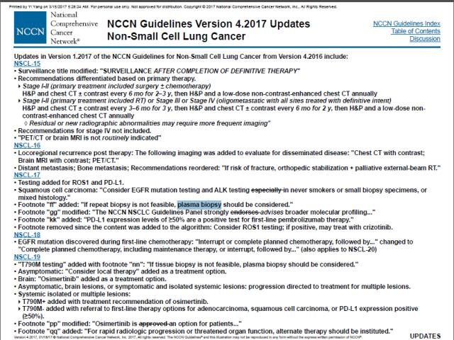

# ctDNA的成长之路：从孟德尔的发现到NCCN指南{#path-of-growth}

第4期，我们将对ctDNA的发展史进行介绍，期望使您理解ctDNA在液体活检中占据重要地位的原因。

ctDNA作为现在液体活检最重要的标志物，从其发现到进入临床应用都经历了哪些过程呢？今天就跟大家分享一下ctDNA研究和应用的历史。

首先为大家展现一个timeline，简要地囊括了ctDNA发展史上的重要事件。

> 
1948年：Mandel和Metais发现血浆中存在游离的核酸分子。
> 
1977年：Leon等人发现，肿瘤患者的血浆游离DNA水平要明显高于健康人群，据此推测游离DNA与肿瘤相关。
> 
1989年：Stroun和colleagues报道肿瘤患者的cfDNA中部分来源于肿瘤细胞。
> 
1994年：第一次利用PCR方法在胰腺癌患者血液cfDNA中检测到了KRAS突变，该突变与肿瘤组织中检测到的一致。
> 
2008年：Diehl F.等对18名肠癌患者的ctDNA进行了跟踪，利用BEAMing技术检测APC、KRAS、TP53、PIK3CA等基因热点突变，发现ctDNA突变率随着治疗过程变化，变化趋势与肿瘤负荷及CEA浓度呈正相关。
> 
2012年：Forshew T等人与Michael W等人分别发表文章，利用分子标签的原理过滤NGS中的PCR错误和测序错误，能够显著降低背景噪音，从而提高NGS检测灵敏度，使之适用于cfDNA中超低频突变的检测。
> 
2014年：欧盟EMA批准利用ctDNA检测EGFR突变用于易瑞沙的伴随诊断，标志着ctDNA正式临床应用。
> 
2015年：《非小细胞肺癌(NSCLC)血液EGFR基因突变检测中国专家共识》于《中华医学杂志》上发表，补充了如果肿瘤标本不可评估EGFR基因状态，则可使用从血液(血浆)标本中获得的ctDNA进行评估。
> 
2016年：非小细胞肺癌NCCN指南中添加了液体活检推荐。


通过这条时间线我们可以看到，ctDNA有着数十年的历史。接下来就为大家详细解说，它是如何从孟德尔的发现一路走进NCCN指南的。

## cfDNA的发现

血中游离DNA简称cfDNA（Cell-Free DNA），是指循环血中游离于细胞外的部分降解了的机体内源性DNA。

早在1948年，比DNA双螺旋结构发现还早6年的时候，Mandel和Metais就发现血浆中存在游离的核酸分子；1977年，Leon等人发现，肿瘤患者的血浆游离DNA水平要明显高于健康人群，据此推测游离DNA与肿瘤相关。但由于缺乏高灵敏性和高特异性的实验方法，导致有关血中游离DNA与疾病相关性的研究在较长时期内进展缓慢。直到有效分离游离DNA技术的出现，和特殊荧光染料与PCR技术相结合的检测技术的应用，才使这一领域的研究得到了较迅速发展。

## ctDNA作为肿瘤标志物地位的确立

1989年，Stroun和colleagues报道肿瘤患者的cfDNA中部分来源于肿瘤细胞；1991年, Sidransky等人研究表明，膀胱癌患者尿沉渣中DNA携带有TP53突变，提示了可以利用基因分析来检测cfDNA；之后陆续在结直肠癌、胰腺癌及肺癌等患者的粪便和痰样本中检测到了KRAS突变。1994年, 第一次利用PCR方法在胰腺癌患者血液cfDNA中检测到了KRAS突变，该突变与肿瘤组织中检测到的一致。也就是说，cfDNA中携带肿瘤特有突变的那一小部分DNA，确确实实是由肿瘤细胞释放出来的。

此后，人们认识到cfDNA中的肿瘤相关突变是肿瘤特异性的标志物，并称这些携带肿瘤特征的cfDNA片段为循环肿瘤DNA（Circulating Tumor DNA，ctDNA）。

## 技术革新促进ctDNA研究爆发

**测序技术限制着ctDNA的研究发展**。直到2000年前后，高灵敏度技术开始出现，ctDNA的研究开始爆发。

随着更高灵敏度的数字PCR（digital PCR，dPCR于1999年出现）和BEAMing技术（于2006年出现）的应用，ctDNA的研究逐渐增多。2008年，Diehl F.等对18名肠癌患者的ctDNA进行了跟踪，利用BEAMing技术检测APC、KRAS、TP53、PIK3CA等基因热点突变，发现ctDNA突变率随着治疗过程变化，变化趋势与肿瘤负荷及CEA浓度呈正相关。

然而，dPCR和BEAMing虽然检测灵敏度高达0.01%，但其检测范围仅局限于少许位点，往往需要先对肿瘤组织进行测序挑选特定位点，再进行后续监测，严重限制了ctDNA研究的广度。

```{r, out.width='100%', fig.cap='单分子编码技术的建立是ctDNA发展史上的一个里程碑。',fig.align='center', echo=FALSE, include=identical(knitr:::pandoc_to(), 'html')}
knitr::include_graphics('image/C4/01.jpg')
```

2012 年，Forshew T等人与Michael W等人分别发表文章，利用分子标签的原理过滤NGS中的PCR错误和测序错误，能够显著降低背景噪音，从而提高NGS检测灵敏度，使之适用于cfDNA中超低频突变的检测（关于这一技术我们会在下一期详细说明）。从此，基于分子标签原理的NGS检测成为ctDNA研究最强大的工具。由于NGS检测范围广的特点，拓展了ctDNA的应用场景，使之可以不局限于特定位点突变频率的检测，还可以进行数十上百个基因的广泛筛查，从而可以应用于药物靶点检测、耐药机制分析、早期肿瘤筛查等方向，ctDNA研究也迎来了爆发期。

2016年ASCO上，美国Guardant Health发布了史上最大规模的ctDNA检测研究结果，其Guardant360平台检测了15191例病人的17628份血液标本和398位病人的组织标本，结果发现，在83%病人的血液中能够检测到ctDNA，血检结果对肿瘤的诊断准确率可高达87% （336/386），若血液检查和组织活检相差六个月内，血检和活检的一致性可高达98%。


## ctDNA逐渐走入临床应用

```{r, out.width='100%', fig.cap='若组织活检不可重复实行，应考虑进行血浆活检。”——NCCN指南，2017年第4版，非小细胞肺癌。',fig.align='center', echo=FALSE, include=identical(knitr:::pandoc_to(), 'html')}

```

随着ctDNA研究的逐渐成熟，利用ctDNA进行临床检测也逐渐受到了认可。2014年9月，欧盟EMA批准利用ctDNA检测EGFR突变用于易瑞沙的伴随诊断，标志着ctDNA正式临床应用。2015年12月，《非小细胞肺癌(NSCLC)血液EGFR基因突变检测中国专家共识》于《中华医学杂志》上发表，补充了如果肿瘤标本不可评估EGFR基因状态，则可使用从血液(血浆)标本中获得的ctDNA进行评估。2016年6月，美国FDA批准罗氏cobas EGFR Mutation Test V2试剂盒作为特罗凯伴随诊断试剂盒，用于血液ctDNA评估EGFR突变情况。2016年10月，非小细胞肺癌NCCN指南也添加了液体活检推荐。

相信随着研究的成熟和样本的积累，ctDNA检测将越来越广泛的临床应用。

## 参考文献{#ref .unnumbered}

1. Mandel, P. & Métais, P. Les acides nucléiques du plasma sanguin chez l’homme. C. R. Seances Soc. Biol. Fil. 142, 241–243 (in French) (1948).
2. Leon, S. A., Shapiro, B., Sklaroff, D. M. & Yaros, M. J. Free DNA in the serum of cancer patients and the effect of therapy. Cancer Res. 37, 646–650 (1977).
3. Stroun, M. et al. Neoplastic characteristics of the DNA found in the plasma of cancer patients. Oncology 46, 318–322 (1989).
4. Sidransky, D. et al. Identification of p53 gene mutations in bladder cancers and urine samples. Science 252, 706–709 (1991).
5. Sidransky, D. et al. Identification of ras oncogene mutations in the stool of patients with curable colorectal tumors. Science 256, 102–105 (1992).
6. Caldas, C. et al. Detection of K‑ras mutations in the stool of patients with pancreatic adenocarcinoma and pancreatic ductal hyperplasia. Cancer Res. 54, 3568–3573 (1994).
7. Mao, L., Hruban, R. H., Boyle, J. O., Tockman, M. & Sidransky, D. Detection of oncogene mutations in sputum precedes diagnosis of lung cancer. Cancer Res. 54, 1634–1637 (1994).
8. Takeda, S., Ichii, S. & Nakamura, Y. Detection of K‑ras mutation in sputum by mutant-allele-specific amplification (MASA). Hum. Mutat. 2, 112–117 (1993).
9. Sorenson, G. D. et al. Soluble normal and mutated DNA-sequences from single-copy genes in human blood. Cancer Epidemiol. Biomarkers Prev. 3, 67–71 (1994).
10. Diehl, F. et al. Circulating mutant DNA to assess tumor dynamics. Nat. Med. 14, 985–990 (2008).
11. Forshew, T. et al. Noninvasive identification and monitoring of cancer mutations by targeted deep sequencing of plasma DNA. Sci. Transl Med. 4, 136ra68 (2012).
12. Schmitt MW. et al. Detection of ultra-rare mutations by next-generation sequencing. Proc Natl Acad Sci U S A. 2012 Sep 4;109(36):14508-13.
13. Large Study Gives Boost to Liquid Biopsy Testing for Mutations. 2016 ASCO Annual Meeting.
