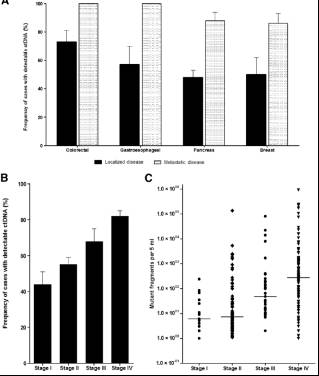
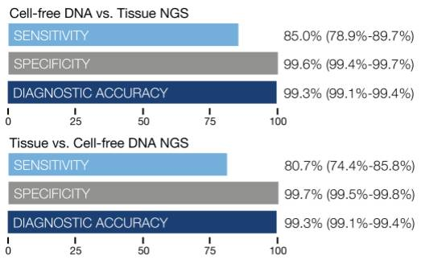
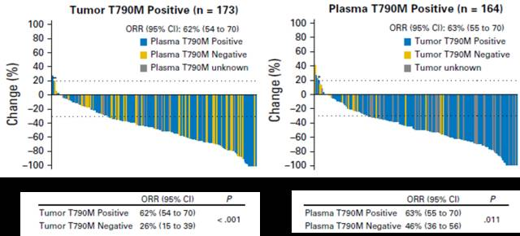
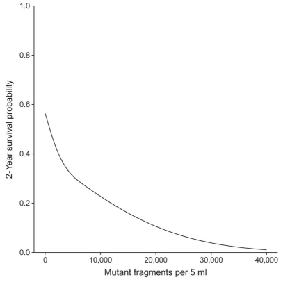

# ctDNA的四大应用{#application-of-ctDNA}

第6期，我们将对ctDNA的应用进行介绍，期望使您掌握目前ctDNA在各方面应用的理论基础和进展情况。

ctDNA检测由于实时、无创、灵活等特点，可以应用于肿瘤的各阶段，解决不同的问题，从早期筛查、辅助诊断、预后判断、到靶向用药指导、疗效及耐药监测等。

由于ctDNA含量与肿瘤负荷、肿瘤分期、转移等密切相关，所以目前晚期肿瘤的用药及监测等应用相对更加成熟；而对于早期肿瘤的筛查与诊断，技术上难度更高，整体上仍处于科研阶段。

## 靶向用药指导

在靶向用药指导上，可以说ctDNA已经确立了江湖地位了。一方面，样本易获取，在组织样本无法获得时可以作为替代品；而另一方面，ctDNA的全面性也可以避免很多肿瘤异质性带来的假阳性。

以Guardant Health的数据为例，我们可以看出，组织和血液互为参照的话，假阳性率都很低，但都存在一定假阴性，血液的敏感性甚至高于组织！也就是说，血液检测的结果绝不只是组织的替代品，而是一个有效的补充。如果血液和组织同时检测，能够进一步提高检出率，使更多患者受益。

另外，组织和血液的阳性结果，对于用药来说，意义是等同的。例如，在AZD9291的临床试验中，组织和血液阳性样本对药物的反应率一致，单样本阳性和双样本阳性的患者生存获益没有差异。

## 动态监测

ctDNA中肿瘤相关的突变频率，会随着肿瘤的进展和治疗而动态变化，因此监测这些突变频率的变化过程，可以指示治疗的疗效、耐药以及肿瘤复发等。

早在2008年，Diehl F.等就发现，APC、KRAS、TP53、PIK3CA等基因热点突变的频率会随着治疗过程变化，变化趋势与肿瘤负荷呈正相关。

同样，ctDNA突变频率的变化也可以指示复发，例如Reinert T.等人通过ctDNA的监测与CT和蛋白标志物的对比，发现在部分病例中，ctDNA频率的升高，要早于影像学和蛋白标志物的变化，以便于尽快采取治疗措施。

## 预后判断

术后ctDNA的检出情况可以提示预后，利用ctDNA特征突变是否检出、突变频率值或术前术后突变频率的变化，均可以作为预后的判断指标。

## 早期筛查与诊断

由于ctDNA释放较少，肿瘤早期的筛查与诊断的难度更高。另外，肿瘤的个体差异导致，难以用少数几个基因状态来衡量所有人，必须需要上百甚至上千个肿瘤相关基因，来建立一个复杂的模型，通过对突变、甲基化等情况的分析来综合考量。

目前，尚没有见到前瞻性研究的成果，不过，已有一些回顾性的研究预示着这种应用的可行性。海普洛斯通过数十例的前期样本，通过ctDNA上百个基因突变的模型，判断肺结节良恶性，并区分病理类型，达到了70%以上的敏感性和特异性；另外，ctDNA甲基化也可用来进行肿瘤诊断和组织溯源。例如，卢煜明教授团队发现，利用ctDNA低甲基化来判断肝癌，可以达到74%的敏感性和94%的特异性；2015年，他们又发文章表示，ctDNA甲基化模式可以区分组织来源。

相信随着研究规模的扩大，大数据与机器学习等手段的运用，利用ctDNA进行肿瘤筛查和诊断也将逐渐成为可能！

## 参考文献{#ref .unnumbered}

1. Bettegowda C, et al. Detection of Circulating Tumor DNA in Early- and Late-Stage Human Malignancies. Sci Transl Med. 2014 Feb 19;6(224):224ra24.
2. Lanman RB, et al. Analytical and Clinical Validation of a Digital Sequencing Panel for Quantitative, Highly Accurate Evaluation of Cell-Free Circulating Tumor DNA. PLoS ONE 10(10):e0140712.
3. Oxnard GR, et al. Association Between Plasma Genotyping and Outcomes of Treatment With Osimertinib (AZD9291) in Advanced Non-Small-Cell Lung Cancer. J Clin Oncol. 2016 Oct 1;34(28):3375-82.
4. Diehl F, et al. Circulating mutant DNA to assess tumor dynamics. Nat. Med. 14, 985–990 (2008).
5. Reinert T, et al. Analysis of circulating tumour DNA to monitor disease burden following colorectal cancer surgery. Gut 2015;0:1–10.
6. Chan KC, et al. Noninvasive detection of cancer-associated genome-wide hypomethylation and copy number aberrations by plasma DNA bisulfite sequencing. Proc Natl Acad Sci U S A. 2013 Nov 19;110(47):18761-8.
7. Sun K, et al. Plasma DNA tissue mapping by genome-wide methylation sequencing for noninvasive prenatal, cancer, and transplantation assessments. Proc Natl Acad Sci U S A.  2015;112(40):E5503-E5512.
