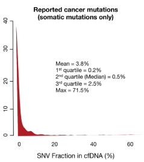
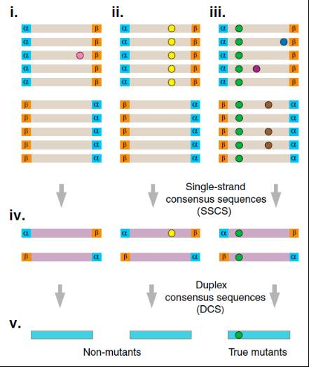

# ctDNA检测的终极武器{#ultimate-weapon}

第5期，我们将对ctDNA的关键技术细节进行介绍，期望使您深刻理解ctDNA在液体活检中占据重要地位的原因。

ctDNA中的肿瘤信息就像是宝藏吸引着科学家们的眼光，然而要想探索宝藏，首先要得到绝世神兵，今天就给大家介绍下这把终极武器的妙用吧！

## ctDNA检测为什么需要更高灵敏度的技术？

ctDNA的检测，相比于组织活检，有更高的灵敏度要求。这其中最重要的原因，就是我们目前没有办法单独获取来自于肿瘤的游离DNA！所谓ctDNA检测，是检测所有cfDNA后分析肿瘤特异性的变异，并将携带这些变异的DNA片段视作ctDNA。

```{r, out.width='100%', fig.cap='从一堆游离DNA中挑出来自肿瘤的游离DNA，可不是一件容易的事儿。',fig.align='center', echo=FALSE, include=identical(knitr:::pandoc_to(), 'html')}
knitr::include_graphics('image/C5/01.jpg')
```

然而，机体的肿瘤细胞相比于正常细胞的数量，简直是九牛一毛。当然这也跟肿瘤的大小、分期、转移等是相关的，不同患者间ctDNA占cfDNA的比例变化范围很大，可从0.01%-90%，大多在千分之几的级别。所以，ctDNA的突变频率明显低于组织活检，有研究表明，有半数以上的突变频率低于0.4%！

```{r, out.width='50%', fig.cap='半数以上的突变频率低于0.4%。突变如此低频，技术须更灵敏。',fig.align='center', echo=FALSE, include=identical(knitr:::pandoc_to(), 'html')}

```

## 常用检测技术为什么难以满足需求？

目前常用的ctDNA检测技术主要有以下几种：

技术|适用性|灵敏度
----|-----|-----
ARMS-qPCR|组织突变检测|1%
NGS|多基因扫描|1%
dPCR|位点监测|0.01%
BEAMing|位点监测|0.01%

ARMS-qPCR操作简便，且有成熟试剂盒。NGS的检测范围广，能同时检测突变、扩增、融合。然而这两种技术都存在灵敏度低的问题，特别是NGS，更需要降低背景噪音的技术。

dPCR和BEAMing的灵敏度足够高，但两者都存在检测位点数目少的局限性，因而不适合用于用药指导。

ARMS-qPCR (Amplification Refractory Mutation System)方法是临床上常用的组织活检突变检测方法，简便易行，大多数医院都可以自行操作。然而在液体活检中，这1%的灵敏度可就不够看了，会导致大量假阴性的出现。《非小细胞肺癌(NSCLC)血液EGFR基因突变检测中国专家共识》中提到，与肿瘤组织相比，基于ARMS方法的ctDNA检测敏感性相对较低，在IPASS、IFUM和IGNITE三项研究中分别为43. 1%、65. 7%和49. 6%，这种敏感性显然是不能满足需求的！

dPCR（digital PCR）和BEAMing的检测方式类似，通过将反应体系细分来提高灵敏度。我们可以理解成一个集成的qPCR反应，将反应体系分成成千上万个，每个反应中含有一个模板DNA分子，通过识别阳性反应数来实现模板分子的绝对定量。反应体系越多，能达到的灵敏度就越高。这两种方法的优势自然是灵敏度，高达0.01%甚至0.001%。然而，我们也能看出，灵敏度跟模板分子数量相关，所以对样本量要求较大，10ml血液往往仅能检测有限几个位点。目前，主要应用在于特定位点的疗效跟踪和耐药监测，对于用药指导、早期辅助诊断等则不适用。

NGS由于存在大量背景噪音，会淹没频率在1%以下的突变，也因此限制了测序的准确度。也就是说，普通的NGS用于ctDNA检测，其结果将会与ARMS-qPCR半斤八两，但为什么NGS技术在ctDNA研究中反而应用越来越广泛呢？**这就要归功于今天的主角——分子标签技术了！**

## 分子标签技术是什么？它是如何提高NGS检测灵敏度的？

要理解分子标签技术的作用，首先要理解NGS的背景噪音来源。NGS有另外一个名字，叫深度测序，也就是说，对于一个位点，需要很多个DNA片段覆盖它，才能够进行准确分析。在这过程中，需要经过模板的PCR扩增，而DNA聚合酶可能会连接上一个错误的碱基，导致错误；另外，测序系统最后的信号识别也会发生错误。当然，常规情况下，我们不知道这些是真突变还是系统错误，而系统错误又极多，所以只能根据突变频率将背景噪音全部过滤，同时低频的真突变也会被殃及，**这就是为什么背景噪音是限制灵敏度的原因了。**

2012年5月，Forshew T等人率先发表文章，开发了基于分子标签的TAm-Seq方法。2012年9月，Michael W等人也发表文章，利用双链分子标签，将错误率显著降低，其中双链匹配的数据中，错误率可降低至∼0.001% mutations/bp！当然，实际应用中很难达到这么高，但也足够将灵敏度提高到0.1%以上了。

分子标签技术是在DNA模板上连接一段随机序列，相当于给每一个DNA模板加上一个独特的分子标签，从而可区分不同来源的模板。这样在进行数据分析时，可以根据标签序列识别同一DNA模板扩增出的片段，把它们统一分析，从而过滤掉PCR错误及测序错误，提高检测灵敏度和准确性。

```{r, out.width='100%', fig.cap='双链分子标签原理图。',fig.align='center', echo=FALSE, include=identical(knitr:::pandoc_to(), 'html')}

```

如图中显示的就是双链分子标签的分析原理，α和β就是一段随机的DNA序列，不同的DNA模板连接的α和β是不一样的。我们**可以通过α和β序列来识别同一模板来源的片段，同时根据α和β互补识别同一模板来源的正反义链（单链分子标签相当于只有α，就无法实现这个功能了）。**

左侧显示的是一个PCR扩增后期引入的错误或一个测序错误，仅影响少数DNA序列，由于同一模板来源的片段理应序列相同，因此利用少数服从多数的原则就可以过滤掉；中间部分显示的是一个PCR扩增早期引入的错误，影响了正链所有序列，但反链无突变，而碱基互补是DNA双链的基本原则，因此这种错误也可以得到校正（仅双链分子标签可以实现）。

通过分子标签技术，可以大幅降低NGS的背景噪音，从而提高测序准确度，**显然双链标签比单链标签的过滤能力更强！**然而，虽然原理上容易理解，科研上也逐渐得到广泛应用，但实现应用起来却存在接头连接效率低、双链互补数据比例少等问题，需要不断优化，还要开发配套的信息分析系统。因此能够实现其应用的公司就寥寥可数了！这些公司的NGS液体活检技术会有所差别，但背景噪音过滤的原理都基于分子标签。

海普洛斯通过不断优化，开发出专利的CUBE-ctDNA测序技术，基于双链分子标签的原理，将检测灵敏度提高至0.05%。

基于分子标签技术的NGS技术，集合了检测范围广和高灵敏度的优势，在肿瘤用药指导、早期诊断、早期筛查、预后判断、耐药机制分析等方面，势必会得到越来越广泛的应用！后面的文章会陆续介绍给大家。

**最后要吐一个槽：一切脱离技术原理吹嘘灵敏度的行为都是耍流氓！**

## 参考文献{#ref .unnumbered}

1. Lanman RB, et al. Analytical and Clinical Validation of a Digital Sequencing Panel for Quantitative, Highly Accurate Evaluation of Cell-Free Circulating Tumor DNA. PLoS ONE 10(10):e0140712.doi:10.1371/journal. pone.0140712.
2. Sorber L, et al. Circulating cell-free nucleic acids and platelets as a liquid biopsy in the provision of personalized therapy for lung cancer patients. Lung Cancer. 2016 May 4. pii: S0169-5002(16)30312-9.
3. Forshew, T. et al. Noninvasive identification and monitoring of cancer mutations by targeted deep sequencing of plasma DNA. Sci. Transl Med. 4, 136ra68 (2012).
4. Schmitt MW. et al. Detection of ultra-rare mutations by next-generation sequencing. Proc Natl Acad Sci U S A. 2012 Sep 4;109(36):14508-13.
