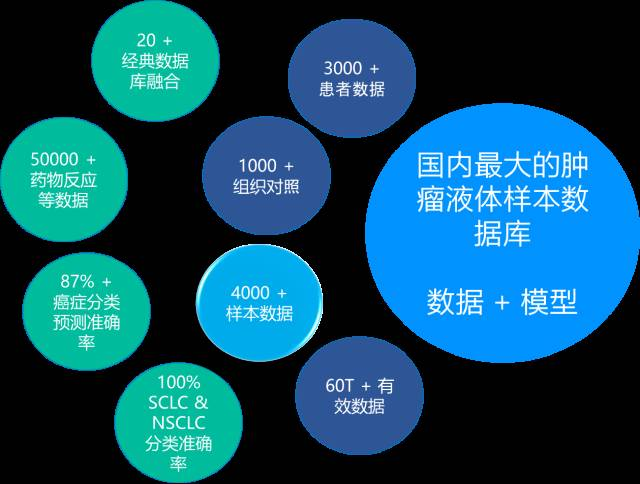

# 海普洛斯在ctDNA方面的探索{#halpoxs-research}

第7期，我们将对海普洛斯在ctDNA应用方面的一些成果、优势和未来方向进行介绍，期望使您了解海普洛斯的技术实力。

## ctDNA检测技术

针对ctDNA中的超低频突变，海普洛斯基于单分子编码原理开发了CUBE-ctDNA专利技术。该技术通过优化测序文库的制备过程，采用三步法：制备、连接、富集，完成对ctDNA的单分子编码标记，有效地过滤二代测序PCR错误及测序错误，结合10000X测序深度，可提高检测灵敏度至0.05%。

另外，常规的开源分析软件对于超低频突变的检出准确性差，因此，海普洛斯针对ctDNA的测序数据分析建立了全新的软件体系，并且将其中很多一部分，以项目名[OpenGene](https://github.com/OpenGene)进行了开源，包括：AfterQC数据过滤和质控、SeqMaker测序数据模拟、MutScan突变扫描和可视化、MrBam测序数据的重复性分析、CfdnaPattern血浆循环DNA的模式识别、FusionDirect融合基因的检出、DeepSomatic基于深度学习的遗传/体细胞突变分类等。这充分显示了海普洛斯在ctDNA检测分析上的实力，也展示了海普洛斯的精神，那就是：开创，开放，开源！

结合测序技术和分析能力，我们进行ctDNA检测的敏感性大大提高。通过155例样本的测试（其中组织EGFR阳性63例，阴性92例），ctDNA检测敏感性达90.5%，特异性达到98.9%。

<table class="" width="542">
<caption><span id="tab:unnamed-chunk-1">Table 7.1: </span>海普洛斯肺癌ctDNA检测数据</caption>
<tbody>
<tr class="">
<td colspan="3" data-bglessp="20%" data-bgless="lighten" style="background-color: rgb(220, 182, 171); border-width: 2px 0px; border-color: rgb(254, 254, 254); color: rgb(110, 46, 26); text-align: center;" width="542" valign="top"><span style="font-size: 14px;">肺癌ctDNA检测</span></td></tr><tr><td data-bglessp="20%" data-bgless="lighten" style="background-color: rgb(220, 182, 171); border-width: 2px 0px; border-color: rgb(254, 254, 254); color: rgb(110, 46, 26); text-align: center;" width="157" valign="top"><p style="white-space: normal;"><span style="font-size: 14px;">EGFR阴性检出率</span></p></td><td data-bglessp="10%" data-bgless="lighten" style="background-color: rgb(205, 150, 135); border-width: 2px 0px; border-color: rgb(254, 254, 254); color: rgb(255, 255, 255); text-align: center;" width="169" valign="top"><p style="white-space: normal;"><span style="font-size: 14px;">EGFR阳性检出率</span></p></td><td style="background-color: rgb(190, 119, 99); border-width: 2px 0px; border-color: rgb(254, 254, 254); color: rgb(255, 255, 255); text-align: center;" width="216" valign="top"><p style="white-space: normal;"><span style="font-size: 14px;">ctDNA与肿瘤组织一致性</span></p></td></tr><tr><td data-bglessp="20%" data-bgless="lighten" style="background-color: rgb(220, 182, 171); border-width: 2px 0px; border-color: rgb(254, 254, 254); color: rgb(110, 46, 26); text-align: center;" width="157" valign="top"><p style="white-space: normal;"><span style="font-size: 14px;">98.9%</span></p></td><td data-bglessp="10%" data-bgless="lighten" style="background-color: rgb(205, 150, 135); border-width: 2px 0px; border-color: rgb(254, 254, 254); color: rgb(255, 255, 255); text-align: center;" width="169" valign="top"><p style="white-space: normal;"><span style="font-size: 14px;">90.5%</span></p></td><td style="background-color: rgb(190, 119, 99); border-width: 2px 0px; border-color: rgb(254, 254, 254); color: rgb(255, 255, 255); text-align: center;" width="216" valign="top"><p style="white-space: normal;"><span style="font-size: 14px;">95.48%</span></p></td></tr></tbody></table>

## 万人癌症基因组计划

万人癌症基因测序计划，是中国首个大型癌症“精准医疗”计划。该计划由深圳市海普洛斯生物科技有限公司携手深圳市人民医院联合启动。该计划针对肺癌、乳腺癌、结直肠癌、胃癌、肝癌等五种中国人群高发癌症，旨在实现10，000人的癌症早期筛查、预后监测、个体化用药指导，建立中国首个大型癌症基因数据库，为实现精准医疗奠定基础。

海普洛斯通过该计划，已收集数千例ctDNA样本，利用这些数据建立基线，区分正常人即会携带的cfDNA突变与肿瘤特异ctDNA突变，能够帮助我们进一步过滤假阳性突变，获得更高的检测准确率。

```{r, out.width='100%', fig.cap='海普洛斯的数据积累',fig.align='center', echo=FALSE, include=identical(knitr:::pandoc_to(), 'html')}

```

## ctDNA与用药指导

海普洛斯基于CUBE-ctDNA技术，开发了一系列ctDNA检测指导肿瘤用药的产品，这一系列称为海普安可(HapOnco<sup>TM</sup>)，主要用于肺癌、结直肠癌、乳腺癌等实体肿瘤靶向药物的用药指导。

海普洛斯也在积极更新和开发新产品，比如针对免疫治疗的用药指导。免疫检查点抑制剂已经在多种肿瘤中显示良好的疗效，但如何筛选适用人群仍然没有定论，其中突变负荷可能是很重要的一个指标。我们正在积极开发基于ctDNA的突变负荷检测产品，这正是基于专用的软件和大量数据建立的基线，能够更准确地识别出ctDNA中的变异。

## ctDNA与肺癌早期诊断

在低剂量螺旋计算机断层扫描（low-dose computed tomography, LDCT）肺癌筛查中会发现大量的结节。目前对于肺结节的良恶性判断主要包括临床和影像学判断。临床评估，包括年龄、性别、职业、吸烟史、费病史和家族史等。

然而在临床应用中，大多数结节是由感染、炎症所形成，为良性结节。在美国国家肺癌筛查试验中，CT筛查组中96.4%的阳性结节为良性。根据统计显示，应用LDCT筛查肺结节直径在5-10mm的患者肺癌发生率为0.9%～5.8%，直径>10mm患者肺癌发生率为11.1%～26.2%。对于LDCT应用于肺癌筛查的假阳性患者，特别是直径<10mm肺结节患者，会导致过度诊断和治疗及增加受检者焦虑。

利用ctDNA检测中癌基因、抑癌基因的突变信息，可以辅助肺结节良恶性的诊断。海普洛斯通过对这些突变构建模型，结合影像学结果进行分析，前期预试验准确率达到74%。目前模型仍在不断优化中，而更大规模的全国多中心临床试验也即将开始。

以上介绍的只是海普洛斯工作中的一部分，我们还会积极创新开发出更多新技术和产品，为肿瘤的预防与治疗提供技术手段，让每一个生命健康120年！

## 参考文献{#ref .unnumbered}

1. Chen S, Han Y, Guo L, Hu J, Gu J, SeqMaker: A Next Generation Sequencing Simulator with Variations, Sequencing Errors and Amplification Bias Integrated, IEEE BIBM 2016.
1. Chen S, Huang T, Zhou Y, Han Y, Xu M and Gu J, AfterQC: Automatic Filtering, Trimming, Error Removing and Quality Control for Fastq Data, APBC 2017.
1. Ashraf H, D. A. (2011). Combined use of positron emission tomography and volume doubling time in lung cancer screening with low-dose CT scanning. Thorax , 66 (4), 315-319. Qinghua Zhou, Y. F. (n.d.).
