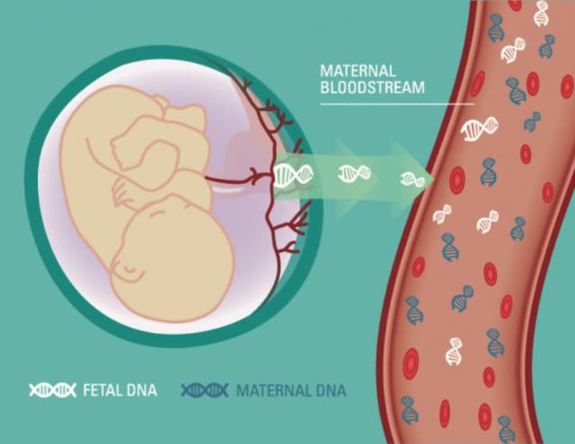
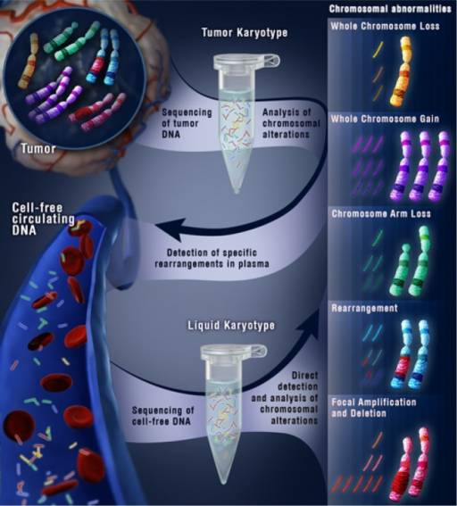

# cfDNA全基因组测序技术的魅与惑{#whole-genome-sequencing-of-plasma-DNA}

第8期，我们将对cfDNA全基因组测序技术进行介绍，期望使您熟悉该领域的发展情况。

## 从无创产检到肿瘤检测

科学研究的一大魅力之处在于，当探究一个问题时，总会伴随有其他的意外发现，同时也有新的问题产生。自然乐于馈赠，亦彰显神秘。cfDNA全基因组测序技术的发展为此做了一个很好的例证。该技术始于无创产前诊断，可以灵敏地检测出妊娠期胎儿染色体倍性异常；然后缘于意外地在无创产前诊断中发现，假阳性结果可能是母体患肿瘤所致，进一步应用到肿瘤诊断领域；再接着通过技术不断改进，又广泛应用于肿瘤研究各个领域，包括驱动变异寻找，耐药机制探究和肿瘤早筛等。

## 无创产前检测中意外诊断出了肿瘤

液体活检第一个走向临床的产品是无创产前诊断，其原理是：在妊娠期，胎儿的游离DNA片段会穿过胎盘释放到母体外周血中，其在母体cfDNA中的比例约为5%-20%。应用大规模平行测序技术对母体cfDNA进行测序，将比对到各染色体的reads数通过均一化后，可代表每条染色体的数量。含有三条21，18或13号染色体的异常胎儿会释放更多特定染色体的cfDNA到母体血浆中，导致该染色体的reads数比例增加。<sup>[1]</sup>

一位37岁的母亲，在妊娠第十三周进行了无创产前检测，结果显示13号染色体为三倍体和18号染色体为单倍体的染色体倍性异常。进一步的羊膜穿刺手术却显示胎儿染色体倍性正常。为了排除无创产前技术操作过程中的问题，该孕妇在妊娠第十七周进行了第二次无创产前检测，结果仍显示13号和18号染色体倍性异常。在产后该母亲出现了明显的子宫颈癌症状，并诊断出了子宫颈癌。肿瘤组织检测发现肿瘤细胞染色体倍性异常。真相终于大白：原来异常的无创产前结果是由于母亲患肿瘤所致，那些异常的cfDNA不是来自胎儿，而是由母体肿瘤释放的。<sup>[2]</sup>

这不是个例，在美国一项针对无创产前假阳性结果的研究中，12.5万的检测样本中，3700多例结果为阳性，其中39例出现多条染色体倍性异常， 这其中的10人进一步被诊断出患有肿瘤，并且她们生下的胎儿都是正常的。因此，当无创产前的检测结果和进一步的羊水穿刺结果不一致时，母亲约有20%-44%的风险患有肿瘤。<sup>[3]</sup>

```{r, out.width='100%', fig.align='center', echo=FALSE}

```


## 技术更新带来肿瘤领域的广泛应用

而上面的问题更容易让我们深入思考，是否我们可以用无创产前技术来做肿瘤诊断？大量的肿瘤基因组测序结果表明，肿瘤基因组总会有染色体结构变异，甚至某些基因组区域的拷贝数变异和融合是肿瘤的驱动突变，在肿瘤的发生和进化过程中起到了关键作用。是否我们可以利用该技术来检测肿瘤患者基因组染色体结构变异，以此来做肿瘤诊断？

在一项应用无创产前技术对16例早期和16例晚期卵巢癌患者进行检测的研究中，分别占6/16和7/16的早期和晚期患者中检测到了>15M染色体区域的倍性异常。<sup>[4]</sup> 这个结果差强人意，但这其实只是无创产前技术上的限制，无创产前技术的cfDNA全基因组测序深度仅有0.1X-0.2X，同时由于CNV算法上的原因，其能检测到染色体倍性改变的区域仅限于大于15M的大区域。如果我们增加测序深度，并改进算法，相信可以检测到小区域内的染色体倍性区域改变，而这些染色体小区域的改变在肿瘤基因组中更常见。果然在另一项研究中，研究者在加大了测序深度，并改进了基因组拷贝数变异算法后，可以检测到小于5M区域的染色体结构变异，在肿瘤患者中检测到亚染色体区域异常的灵敏度达到了29/31。<sup>[5]</sup>

在目前测序成本较高的情况下，进行高深度的cfDNA全基因组测序并不现实，于是发展出了新的折中模式：低深度全基因组测序+高深度区域靶向测序。低深度全基因组测序可以检测出大区域的染色体结构变异，为了进一步深入研究小区域内的基因组拷贝数变异，可以进行区域靶向高深度测序。这样便可以较全面有针对性的检测出肿瘤染色体结构变异。该技术很快便广泛应用于与肿瘤拷贝数变异相关的驱动变异寻找，治疗检测和耐药机制探究等领域。<sup>[6-8]</sup>

```{r, out.width='100%', fig.align='center', echo=FALSE}

```

## 在肿瘤早筛中的机遇与挑战

在肿瘤研究领域，肿瘤早筛是目前难以跨越的高峰。因为在肿瘤发生早期，癌变的细胞数目非常有限，常规的影像学和蛋白分子标记等检测手段无能为力。来自于受检者外周血中的cfDNA，可以动态全面的反映受检者基因组状况，因此是绝佳的肿瘤早筛研究对象。早期肿瘤细胞释放到血液中的ctDNA量同样非常有限，其在cfDNA中的含量一般在万分之一以下，因此想检测到ctDNA中SNV和INDEL水平上的变异，对于目前的DNA检测技术来讲，非常具有挑战性。但是我们可以利用cfDNA全基因组测序技术，检测其是否有染色体结构异常，即便是万分之一以下的变异，技术上也是可行的。

然而，利用该技术进行肿瘤早筛，仍然困难重重：首先，我们需要获得健康人的cfDNA染色体倍性基线，cfDNA有独特的断裂方式，释放到血浆中的cfDNA并不是均匀覆盖基因组，因此健康人基线对于灵敏检测非常关键。其次，要想获得合理的测序深度和染色体结构变异算法，需要不断的技术优化。最后，能否检测到特异的染色体结构变异，以此作为肿瘤早筛的分子标记，尚需要事实来说话。

## 参考文献{#ref .unnumbered}

1. PrasadV., Non-invasive, serum DNA pregnancy testing leading to incidental discoveryof cancer: A good thing?,Eur J Cancer (2015)
2. OsborneCM, Hardisty E, Devers P, et al. Discordant noninvasive prenatal testingresults in a patient subsequently diagnosed with metastatic disease.PrenatDiagn 2013;33(6):609–11.
3. Tanday S.Prenatal testing can detect occult cancer in pregnantwomen. Lancet Oncol. 2015 Aug;16(8):e383
4. Cohen PA, Flowers N, Tong S, Hannah N, Pertile MD, Hui L. Abnormalplasma DNA profiles in early ovarian cancer using a non-invasive prenataltesting platform: implications for cancer screening. BMC Med. 2016;14(1):126.doi: 10.1186/s12916-016-0667-6.
5. Lo KK, Karampetsou E, Boustred C, McKay F, Mason S, Hill M, et al. LimitedClinical Utility of Non-invasive Prenatal Testing for SubchromosomalAbnormalities. Am J Hum Genet. 2016;98(1):34–44. Epub 2015/12/29. PubMedCentral PMCID: PMC4716686.
6. Leary RJ, Sausen M, Diaz LA, Velculescu VE. Cancer detection using whole-genomesequencing of cell free DNA. Oncotarget. 2013;4:1119–1120.
7. Mohan S, Heitzer E, Ulz P, Lafer I, Lax S, et al. (2014) Changes in ColorectalCarcinoma Genomes under Anti-EGFR Therapy Identified by Whole-Genome Plasma DNASequencing. PLoS Genet 10(3): e1004271. doi:10.1371/journal.pgen.1004271
8. Diaz LA, Jr, Sausen M, Fisher GA, Velculescu VE. Insightsinto therapeutic resistance from whole-genome analyses of circulating tumorDNA. Oncotarget. 2013;4:1856–1857.